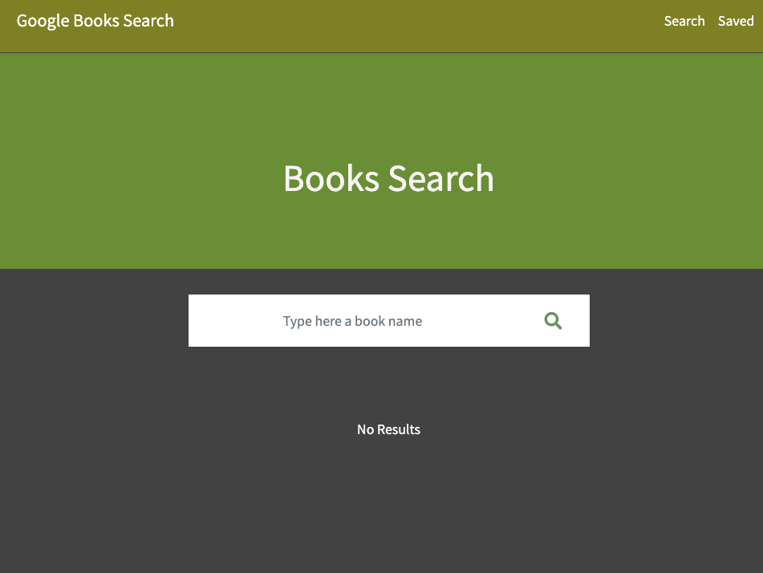

# Google Books Search

[](https://github.com/siryaw/google-books-search)

## Description

Search books using the google books api. add books to your saved list


## Table of Contents 

* [Installation](#installation)
* [Usage](#usage)
* [Tests](#tests)
* [License](#license)
* [Contributing](#contributing)

* [Questions](#questions)

## Installation

Run to install the necessary dependecies: 

```
npm i
```

## Tests

Run command for test:

```
undefined
```

## Usage

feel free to clone 

## License
This project is licensed under the MIT license.
  
## Contributing

pull request

## Questions


If you have any questions about the repo, open an issue or contact [siryaw](https://api.github.com/users/siryaw) directly at null.
